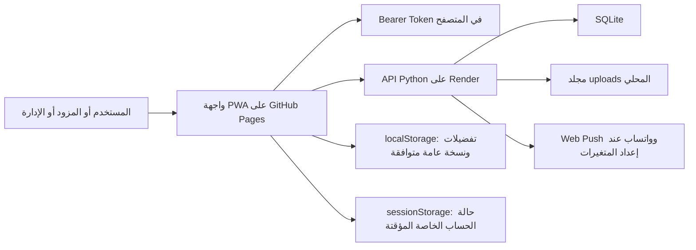

# تقرير الوضع الحالي لمشروع خدماتي

**تاريخ الفحص:** 26 يوليو 2026
**الفرع:** `release/production-readiness`
**آخر Commit مستقر قبل المهمة:** `4b5145111408c63e144ad778d42b24c785499bf3`
**حالة مساحة العمل قبل الفحص:** نظيفة، ولا توجد تعديلات غير محفوظة
**حالة هذا التقرير:** فحص فعلي قبل أي تعديل في منطق التطبيق

## 1. الملخص التنفيذي

مشروع «خدماتي» تطبيق ويب تقدمي PWA متقدم وظيفيًا، وليس تطبيق iOS أو Android أصليًا حاليًا. الواجهة مبنية بملف HTML/JavaScript كبير وطبقات CSS متتابعة، والخادم مكتوب بلغة Python باستخدام مكتبات Python القياسية مع SQLite، ويعمل حاليًا بواجهة منشورة على GitHub Pages وخادم مبدئي على Render.

نجحت الاختبارات الحالية في المسارات الأساسية: تسجيل الحسابات، إنشاء الطلب، المطابقة الدقيقة، ساحة الطلبات، المحادثة والرسائل الصوتية، الترشيحات، الاشتراكات، موافقات مشاركة التواصل، عزل الزائر، وصلاحيات عدد من واجهات API. هذا أساس جيد وقابل للتطوير.

مع ذلك، لا يمكن اعتبار الوضع الحالي جاهزًا للإطلاق العام. العائق الأكبر هو أن إعداد Render الموجود في المستودع لا يعلن قرصًا دائمًا أو قاعدة بيانات مُدارة، بينما الخادم يحفظ SQLite والصور افتراضيًا على نظام الملفات المحلي. إذا لم تكن هناك إعدادات يدوية خارج المستودع، فقد تضيع البيانات والملفات عند إعادة النشر أو إعادة تشغيل الخدمة. توجد أيضًا بيانات عرض تجريبية تُزرع تلقائيًا في كل قاعدة جديدة، ولا توجد Migrations منظمة أو علاقات Foreign Key مفروضة، ولا توجد CI/CD في GitHub.

## 2. بنية المشروع

### الواجهة

- النوع: تطبيق ويب تقدمي PWA.
- التقنية: HTML وJavaScript وCSS دون React أو Next.js أو Flutter أو React Native.
- الملف الرئيسي: `index.html`.
- نسخة الخادم الثابتة: `public/index.html`.
- نظام التصميم الحالي: ملف مركزي واحد هو `assets/styles/khadamati-v1.css`، بعد تنظيف طبقات الأنماط التاريخية.
- الخريطة: نسخة محلية من Leaflet داخل `vendor/`.
- التخزين المحلي: `localStorage` للحالة العامة المتوافقة، و`sessionStorage` للحالة الخاصة المؤقتة.
- Service Worker: `service-worker.js`.
- Manifest: `manifest.webmanifest`.

### الخادم

- التقنية: Python.
- الخادم: `ThreadingHTTPServer` و`SimpleHTTPRequestHandler` من مكتبة Python القياسية.
- الملف الرئيسي: `server.py`.
- منطق المجال: `khadamati_domain.py`.
- الإشعارات الهاتفية: `pywebpush` اختيارية.
- لا يوجد إطار خادم مثل Django أو Flask أو FastAPI.

### قاعدة البيانات

- قاعدة البيانات الفعلية: SQLite عبر `sqlite3`.
- لا يوجد ORM.
- المخطط يُنشأ ويُحدّث داخل `init_db()` في `server.py`.
- يوجد `postgres_schema.sql` ودليل انتقال، لكن الخادم الحالي لا يتصل بـPostgreSQL.
- تقرير الواجهة يعرض حاليًا `postgresReady: true` رغم أن الاتصال الفعلي SQLite؛ هذه معلومة مضللة يجب تصحيحها.

### النشر الحالي

- الواجهة: GitHub Pages.
- API: Render على الرابط الموثق داخل المشروع.
- `render.yaml` مرتبط بفرع `main` ويستخدم `autoDeployTrigger: commit`.
- المهمة الحالية تعمل على فرع مستقل ولن تعدل `main` أو تنشر إلى Render.

## 3. تدفق البيانات المبسط

الخادم هو مصدر الحقيقة للحسابات والطلبات والمحادثات والإشعارات عند توفره. الواجهة تحتفظ بطبقة توافق محلية كبيرة، وقد تعرض بيانات بذور مؤقتة قبل اكتمال المزامنة أو عند تعذر الخادم.

## 4. طريقة حفظ البيانات

| النوع | مكان الحفظ الحالي |
|---|---|
| المستخدمون | جدول `app_users` |
| مزودو الخدمة والشركات | جدول `providers` |
| طلبات تسجيل المزود | جدول `provider_requests` |
| طلبات العملاء | جدول `customer_requests` |
| العروض والمحادثات والرسائل | حقول JSON داخل `customer_requests` |
| الإشعارات | جدول `app_notifications` |
| الاشتراكات | `subscriptions` و`subscription_events` |
| المدفوعات والفواتير | `payments` و`invoices` |
| موافقات التواصل | `contact_consents` |
| ترشيحات المزودين | `request_provider_suggestions` |
| الجلسات | `auth_sessions` مع حفظ Hash للرمز |
| الصور والمرفقات | ملفات في `KHADAMATI_UPLOAD_DIR` ومسارات داخل SQLite |
| تفضيلات الواجهة | `localStorage` |
| نسخة الحالة الخاصة في المتصفح | `sessionStorage` |

## 5. المصادقة والأدوار

### الموجود فعليًا

- رموز جلسة عشوائية تُحفظ بصيغة Hash داخل `auth_sessions`.
- رموز الدخول PIN تُخزن باستخدام PBKDF2-SHA256 بعدد 160,000 دورة.
- صلاحية الجلسة الافتراضية 30 يومًا.
- إبطال الجلسة عند تسجيل الخروج أو تغيير PIN.
- قفل مؤقت بعد تكرار محاولات الدخول.
- أدوار الإدارة: `super_admin` و`admin` و`manager` و`support` و`finance`.
- أدوار فريق المزود: `provider_owner` و`provider_manager` و`provider_staff`.
- تحقق خادمي لعدد كبير من صلاحيات الإدارة والمزود.

### الملاحظة الأمنية

الواجهة تحفظ Bearer Tokens في `localStorage` بالإضافة إلى `sessionStorage`. هذا يحافظ على الجلسة بعد إغلاق التطبيق، لكنه يزيد أثر أي ثغرة XSS. كما أن سياسة CSP تسمح بـ`unsafe-inline` لأن التطبيق يعتمد على JavaScript مضمّن داخل ملف HTML كبير. الانتقال إلى Cookies من نوع HttpOnly أو فصل السكربتات يحتاج خطة توافق واختبارات ولا ينبغي تنفيذه كتعديل سريع.

## 6. نتائج فحص قاعدة البيانات المحلية

- الحجم: 9,158,656 بايت.
- عدد الجداول: 38.
- `PRAGMA integrity_check`: `ok`.
- وضع Journal: `delete`.
- `PRAGMA foreign_keys`: غير مفعّل.
- عدد علاقات Foreign Key المعرفة: صفر.
- لا توجد هواتف مستخدمين مكررة.
- لا توجد هواتف مزودين نشطين مكررة.
- لم تظهر سجلات يتيمة في الفحوصات المنطقية الحالية للاشتراكات أو الطلبات أو الترشيحات أو الموافقات أو الفرق والفروع.
- توجد 12 بطاقة مزود تجريبية مزروعة بمعرفات `p1` إلى `p12`.
- توجد مراجعتان تجريبيتان مزروعتان.
- الخطط القديمة معطلة حاليًا وليست نشطة.

سلامة القاعدة الحالية جيدة في العينة المحلية، لكن غياب القيود يعني أن الخادم وحده مسؤول عن منع السجلات اليتيمة والتكرار.

## 7. الأشياء التي تعمل

- تشغيل وتجميع ملفات Python.
- إنشاء قاعدة جديدة مع مخططها.
- تسجيل مستخدم ومزود وشركة.
- تسجيل الدخول والخروج واستعادة الجلسة.
- عزل الزائر عن بيانات الحساب.
- إنشاء الطلب وحفظه مركزيًا.
- المطابقة الدقيقة حسب القسم والخدمة.
- إرسال الطلب إلى المزودين المطابقين.
- ساحة الطلبات والطلبات النشطة.
- ترشيح مزود ومنع إساءة الاستخدام الأساسية.
- قبول العروض ودورة المهمة.
- المحادثات النصية والصور والصوت في الاختبار.
- موافقة مشاركة الهاتف حسب الطلب والمزود والقناة.
- الباقات الخمس ومنطق الترقية والتخفيض والسماح.
- منع التلاعب بمبلغ الدفع داخل منطق المجال.
- صلاحيات خادمية أساسية للإدارة والمزود.
- حماية الوسائط الخاصة بروابط موقعة.
- CORS بقائمة Origins محددة.
- Service Worker لا يخزن API أو الوسائط الخاصة.
- واجهة عربية RTL وإنجليزية LTR ضمن اختبار الواجهة الحالي.
- ملاءمة الواجهة عند عرض 320px ضمن الاختبار الآلي الحالي.

## 8. الأشياء غير المكتملة أو غير المثبتة

- لا توجد قاعدة بيانات إنتاجية دائمة مثبتة من ملفات المشروع.
- لا يوجد تخزين ملفات دائم مثبت من ملفات المشروع.
- لا توجد عملية نسخ احتياطي مجدولة ومختبرة.
- لا توجد عملية استعادة موثقة ومختبرة على نسخة معزولة.
- لا توجد Migrations مرقمة ومستقلة؛ التعديل يتم داخل بدء تشغيل الخادم.
- لا توجد CI/CD في `.github/workflows`.
- لا توجد حماية Branch موثقة أو Required Checks.
- لا توجد بيئة staging محددة.
- لا يوجد Dockerfile، ولم يثبت بعد أن إضافته مفيدة.
- الدفع وOTP والواتساب وPush تعتمد على إعدادات خارجية غير مثبتة في هذا الفحص.
- لا يوجد تطبيق أصلي أو غلاف متجر مثبت.
- لا يوجد فحص أداء خادمي متعدد المستخدمين موثق.
- لا توجد مراجعة اختراق بشرية مستقلة.
- كان README متأخرًا عن التطبيق، وتمت مزامنته مع إصدار V1.

## 9. الأخطاء والمخاطر الحرجة

### حرجة: خطر فقد البيانات والملفات على Render

**الدليل:** `render.yaml` يستخدم خدمة مجانية ولا يعرّف قرصًا دائمًا أو قاعدة مُدارة، بينما `server.py` يستخدم SQLite ومجلد `public/uploads` افتراضيًا.
**الأثر:** احتمال فقد الحسابات والطلبات والمحادثات والصور بعد إعادة نشر أو إعادة تشغيل.
**الحالة:** تحتاج التحقق من لوحة Render ثم قرارًا واعيًا: قرص دائم مؤقت، أو PostgreSQL وتخزين كائنات. لا يجوز تنفيذ الانتقال دون موافقة وخطة Migration وRollback.

### حرجة: لا توجد نسخة احتياطية إنتاجية واستعادة مثبتة

يوجد Backup قبل Migration اشتراكات محددة، لكنه ليس نظام نسخ احتياطي دوريًا ولا يحمي ملفات الرفع. لا يمكن إطلاق منتج حقيقي دون RPO/RTO وخطة استعادة مجربة.

## 10. الأخطاء والمخاطر العالية

1. **بيانات تجريبية في مسار الإنتاج:** كل قاعدة جديدة تزرع 12 مزودًا ومراجعتين. القاعدة المحلية الحالية تحتويها. يجب إيقاف الزرع في الإنتاج مستقبلًا، أما حذف الموجود فيحتاج موافقة لأنه حذف بيانات.
2. **غياب العلاقات والقيود:** جميع الجداول بلا Foreign Keys وميزة `foreign_keys` غير مفعلة.
3. **جلسات المتصفح:** Bearer Tokens محفوظة في `localStorage` مع CSP تسمح بـ`unsafe-inline`.
4. **SQLite مع خادم متعدد الخيوط:** لا يوجد WAL أو ضبط Busy Timeout مركزي أو Pooling، ما يزيد مخاطر قفل الكتابة تحت التزامن.
5. **أحجام JSON كبيرة:** بعض المسارات تسمح حتى 60MB Base64 داخل الذاكرة، ما يزيد خطر استهلاك الذاكرة والحرمان من الخدمة.
6. **لا توجد CI:** يمكن دفع كود يفشل الاختبارات إلى الفرع الرئيسي حاليًا.
7. **Migrations ضمن بدء التشغيل:** أي خطأ مخطط قد يظهر أثناء تشغيل الخدمة، ولا توجد سلسلة إصدارات أو أمر تحقق منفصل.
8. **لا يوجد تحقق من استمرارية Render داخل المستودع:** لا يمكن الجزم بمكان قاعدة العمل الحالية أو نسخها الاحتياطية.

## 11. الأخطاء والمخاطر المتوسطة

1. `index.html` يتجاوز 1MB ويحتوي منطقًا وواجهة وترجمة في ملف واحد؛ صيانته ومراجعته الأمنية أصعب.
2. يوجد نسخ مزدوج للواجهة والأصول الأساسية بين الجذر و`public/`. النسخ متطابقة الآن، لكن لا توجد آلية تمنع اختلافها مستقبلًا.
3. `get_bootstrap()` للإدارة يجلب كل الإشعارات دون تقييد `target_kind='admin'`، ما يخلط مركز الإدارة بإشعارات الحسابات.
4. Health Check الحالي `/api/bootstrap` ينفذ صيانة واستعلامات كثيرة وليس فحص جاهزية خفيفًا.
5. `Cache-Control: no-store` يطبق من الخادم على جميع الاستجابات، بما في ذلك الأصول الثابتة التي يمكن تخزينها بأمان.
6. Rate Limiting موجود لمسارات حساسة محددة، لكنه ليس سياسة مركزية شاملة لكل عمليات الكتابة.
7. الحقول المركبة JSON داخل SQLite تقلل قابلية الفهرسة والتحقق العلاقي للمحادثات والعروض والخدمات.
8. لا توجد Structured Logs أو Correlation ID.
9. لا توجد مراقبة أعطال أو تنبيه تشغيلي مثبت.
10. الإعداد `postgresReady: true` لا يعكس التنفيذ الفعلي.

## 12. الأخطاء والمخاطر المنخفضة

1. كان README غير متزامن مع التطبيق وService Worker، وتم إصلاحه في V1.
2. كانت ملفات CSS تراكمية؛ وُحدت بعد قياس أثرها واختبارات المقارنة البصرية.
3. لا توجد ملفات AGENTS.md حاليًا.
4. توجد مخلفات اختبارات محلية كثيرة لكنها مستثناة من Git.
5. لا توجد TODO أو FIXME ظاهرة في الملفات الأساسية، لكن هذا لا يعني اكتمال كل المسارات.

## 13. نتائج الاختبارات قبل التعديل

| الفحص | النتيجة |
|---|---|
| Python compile | ✅ نجح |
| Unit Tests | ✅ 15 من 15 |
| Security API | ✅ 12 فحصًا |
| API smoke | ✅ جميع المسارات المعلنة نجحت |
| UI smoke | ✅ المستخدم والطلب والمزود والإدارة وملاءمة الهاتف |
| أداء الواجهة المحلي | ✅ ضمن الهدف المحلي |

قياسات الأداء المحلية:

- DOM Content Loaded: 91ms.
- Load: 104ms.
- First Contentful Paint: 120ms.
- Interactive Ready: 1247ms.
- الحجم المنقول: 1,090,869 بايت.

هذه أرقام بيئة محلية وليست ضمانًا لأداء Render أو شبكة الهاتف أو القدرة على تحمل مستخدمين متزامنين.

## 14. فحص الأسرار

- لم تظهر مفاتيح خاصة أو أنماط قوية لمفاتيح OpenAI أو GitHub أو AWS في الملفات المتعقبة.
- لم تظهر هذه الأنماط في تاريخ Git.
- النتائج الوحيدة في الفحص العام كانت Tokens وهمية داخل `tests/smoke-ui.js`.
- لم تُعرض أو تُنسخ أي قيمة سرية.
- ما زال يلزم إضافة فحص أسرار تلقائي في CI.

## 15. المشكلات التي تمنع الإطلاق

1. إثبات استمرارية قاعدة البيانات والملفات على بيئة الإنتاج.
2. إعداد واختبار النسخ الاحتياطي والاستعادة.
3. فصل بيانات العرض التجريبية عن الإنتاج.
4. تجهيز CI وفحوصات إلزامية قبل الدمج.
5. تنظيم Migration آمنة بدل تعديلات بدء التشغيل وحدها.
6. اختبار تزامن وأداء للخادم وقاعدة البيانات في staging.
7. مراجعة استراتيجية الجلسات وCSP.
8. التأكد من إعداد OTP والدفع والإشعارات دون ادعاء جاهزيتها قبل المفاتيح.
9. تجهيز سياسات فعلية ومراجعتها قانونيًا.
10. تحديد مسار تطبيقات المتاجر بناءً على قرار PWA/WebView/تطبيق أصلي.

## 16. خطة التنفيذ المقترحة

### الأولوية الأولى: تعديلات آمنة داخل الفرع

1. إنشاء AGENTS.md بقواعد عدم النشر وعدم الأسرار.
2. إضافة فحص إعدادات Production يمنع التشغيل بإعدادات تخزين غير معلنة دون تحذير واضح.
3. إضافة Health وReadiness endpoints خفيفة.
4. إيقاف زرع البيانات التجريبية في بيئة production الجديدة دون حذف بيانات حالية.
5. تصحيح `postgresReady`.
6. فصل إشعارات الإدارة خادميًا.
7. إضافة اختبارات Regression لهذه التغييرات.
8. إضافة GitHub Actions للتجميع والوحدات والأمان وSmoke مع منع النشر.
9. تحديث README و`.env.example`.

### الأولوية الثانية: تجهيز يحتاج قرارًا قبل التطبيق

1. اختيار تخزين دائم لقاعدة البيانات.
2. اختيار تخزين دائم للصور والمرفقات.
3. خطة PostgreSQL أو إبقاء SQLite على قرص دائم لفترة انتقالية.
4. خطة ترحيل Tokens إلى Cookies HttpOnly أو تقليل مخاطر XSS عبر فصل JavaScript.
5. تنظيف بيانات البذور الموجودة فعليًا.

### الأولوية الثالثة: التوثيق والتسليم

إكمال أدلة الخادم، النسخ الاحتياطي، المتاجر، السياسات، الإجراءات العمانية، الهوية، التراخيص، التمويل والتسليم، مع فصل الحقائق المتحققة عن المسودات التي تحتاج مراجعة رسمية.

## 17. الملفات المتوقع تعديلها

- `AGENTS.md`
- `.env.example`
- `.gitignore`
- `README.md`
- `server.py`
- `khadamati_domain.py` عند الحاجة
- `tests/test_domain.py`
- `tests/security-api.py`
- `tests/smoke-api.py`
- ملفات جديدة داخل `.github/workflows/`
- ملفات جديدة داخل `ملفات-الإطلاق/`

لن تُعدل ملفات الواجهة إلا إذا أثبت اختبار أو تدقيق وجود خلل مرتبط مباشرة بجاهزية الإنتاج.

## 18. قرارات تحتاج موافقة المالك

1. نوع قاعدة البيانات الإنتاجية ومكان ملكيتها.
2. نوع تخزين الصور والمرفقات ومكان ملكيته.
3. شراء أو ترقية أي خطة Render أو قاعدة أو تخزين.
4. حذف أو أرشفة المزودين والمراجعات التجريبية الموجودة.
5. تغيير معماري لنظام الجلسات.
6. اعتماد مزود OTP وواتساب والإشعارات.
7. اعتماد بوابة الدفع.
8. إنشاء حسابات Apple وGoogle أو أي حساب رسمي.
9. النشر العام أو تعديل production أو DNS.
10. المعلومات القانونية والتجارية النهائية.

## النتيجة

المشروع **متقدم وظيفيًا لكنه غير جاهز للإطلاق العام بعد**. الاختبارات الحالية تمنح ثقة جيدة في منطق التطبيق، بينما استمرارية البيانات والنسخ الاحتياطي وCI وبيئة الإنتاج هي العوائق الحقيقية الأعلى أولوية. ستُنفذ بعد هذا التقرير فقط التغييرات الآمنة والقابلة للعكس على الفرع المستقل، ولن يحدث دمج أو نشر عام.
