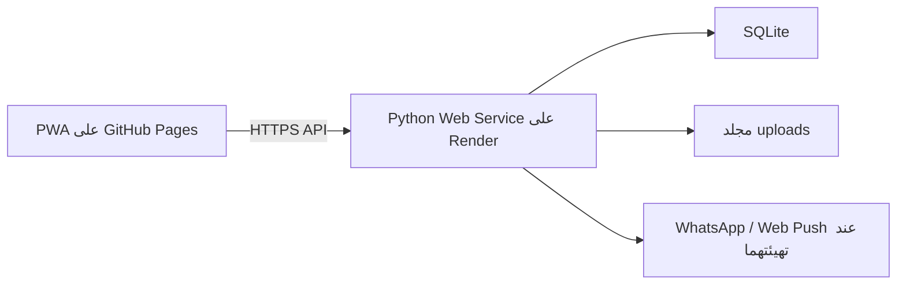

# دليل الخادم والنشر والتشغيل

**تاريخ التحقق:** 26 يوليو 2026

**الفرع:** `release/production-readiness`

**الحالة:** تجهيز فقط؛ لم يُعدل Render الفعلي ولم يحدث نشر عام

## 1. البنية الحالية المثبتة من المشروع



- الواجهة: Static PWA على GitHub Pages.
- الخادم: `ThreadingHTTPServer` في `server.py`.
- البيانات: SQLite.
- الملفات: مجلد محلي يحدده `KHADAMATI_UPLOAD_DIR`.
- Blueprint: `render.yaml`.
- الخدمة المعلنة: `khadamati-app-api`.
- الفرع المعلن في Blueprint: `main`.
- الخطة المعلنة: `free`.
- Auto Deploy معلن عند Commit.
- Health Check المجهز: `/healthz`.
- لا يوجد Persistent Disk أو Render Postgres معلن في `render.yaml`.

هذه المعلومات من المستودع فقط. لم يتم الدخول إلى لوحة Render، ولذلك لا يمكن إثبات ما إذا كانت إعدادات يدوية مختلفة موجودة هناك.

## 2. النتيجة الحرجة

وثائق Render الرسمية تنص على أن نظام الملفات افتراضيًا مؤقت، وأن التغييرات تضيع عند إعادة النشر أو إعادة التشغيل إذا لم يوجد Persistent Disk. كما توضح أن القرص الدائم يتوفر للخدمات المدفوعة، ولا يمكن مشاركة القرص بين عدة نسخ من الخدمة.

بناءً على ذلك:

- 🔴 لا يجوز اعتبار SQLite أو `uploads` الحالية دائمة من `render.yaml`.
- 🔴 لا يجوز إطلاق مستخدمين حقيقيين قبل إثبات مكان البيانات ووجود Backup مستقلة.
- ⛔ لم تُرق الخطة ولم يُضف قرص لأن ذلك يتطلب تكلفة وموافقة.

المصدر الرسمي:

- Render Persistent Disks: <https://render.com/docs/disks>
- Render Web Services: <https://render.com/docs/web-services>
- تاريخ التحقق: 26 يوليو 2026.

## 3. مسارا البنية المقترحان

### المسار A: SQLite على قرص دائم، مرحلة انتقالية

يناسب إطلاقًا محدودًا بعد قياس الحمل:

- خدمة Render مدفوعة واحدة.
- Persistent Disk عند `/var/data`.
- `KHADAMATI_DB_PATH=/var/data/khadamati.sqlite3`.
- `KHADAMATI_UPLOAD_DIR=/var/data/uploads`.
- `KHADAMATI_BACKUP_DIR=/var/data/backups`.
- نسخة Backup إضافية خارج القرص نفسه.

القيود:

- نسخة خادم واحدة فقط.
- لا يوجد توسع أفقي.
- القرص يمنع Zero-Downtime Deploy وفق وثائق Render.
- Rollback للكود لا يعيد حالة القرص؛ استعادة البيانات عملية مستقلة.
- SQLite قد تصبح عنق زجاجة تحت الكتابة المتزامنة.

**الحالة:** 🔴 يحتاج خطة مدفوعة وموافقة المالك.

### المسار B: PostgreSQL وتخزين ملفات منفصل

الأنسب للتوسع طويل المدى:

- Render Postgres أو قاعدة PostgreSQL مملوكة للمؤسسة.
- تخزين كائنات خاص للصور والوثائق.
- Migration مدروسة من SQLite.
- اختبار مزدوج على staging.
- Backfill وفحص Counts وبصمات.
- خطة رجوع إلى Snapshot السابقة.

العمل المطلوب قبل تنفيذه:

1. اختيار الخدمات والملكية والتكلفة.
2. تثبيت Schema النهائي.
3. إنشاء Data Adapter فعلي لـPostgreSQL؛ الملف الحالي `postgres_schema.sql` وحده لا يكفي.
4. تصدير نسخة من SQLite بعد Backup.
5. ترحيل تجريبي إلى staging.
6. مقارنة الجداول والعلاقات والملفات.
7. تجميد كتابة قصير عند النقل النهائي.
8. توثيق Rollback.

**الحالة:** ⛔ لم يُنفذ لأنه تغيير معماري وتكلفة ومخاطر بيانات.

## 4. البيئات

### Development

- `KHADAMATI_ENV=development`.
- قاعدة ومجلد رفع محليان.
- يمكن تفعيل بيانات العرض صراحة.
- رمز الإدارة التطويري فقط عبر `KHADAMATI_DEV_ADMIN_CODE`.
- لا تستخدم بيانات حقيقية.

### Test

- `KHADAMATI_ENV=test`.
- قاعدة ومجلد رفع مؤقتان لكل اختبار.
- أسرار اختبار غير إنتاجية.
- تشغيل Unit وAPI وUI.

### Staging

غير موجودة فعليًا الآن. المقترح:

- خدمة منفصلة وفرع منفصل.
- قاعدة وملفات منفصلة تمامًا.
- لا تنسخ بيانات مستخدمين حقيقية إلا بعد إخفائها وموافقة الخصوصية.
- Auto Deploy يمكن ربطه بفرع staging بعد نجاح CI.
- اختبار Migration وRestore والأداء فيها.

### Production

- لا تُنشأ أو تُعدل ضمن هذه المهمة.
- يجب أن تكون الحسابات والخدمات باسم المالك أو المؤسسة.
- لا نشر إلا من Commit مُراجع وناجح الفحوصات.
- لا Dev OTP أو Demo Seed.

## 5. متغيرات البيئة

### مطلوبة للتشغيل

- `KHADAMATI_ENV`
- `KHADAMATI_RELEASE`
- `HOST`
- `PORT`
- `KHADAMATI_PUBLIC_URL`
- `KHADAMATI_ALLOWED_ORIGINS`
- `KHADAMATI_DB_PATH`
- `KHADAMATI_UPLOAD_DIR`
- `KHADAMATI_BACKUP_DIR`
- `KHADAMATI_MEDIA_SIGNING_KEY`

### مطلوبة عند إنشاء الإدارة أول مرة

- `KHADAMATI_ADMIN_CODE`

يُغيّر الرمز بعد الدخول ثم يمكن إزالة قيمة التهيئة وفق Runbook متفق عليه. لا ترسل القيمة في Git أو المحادثات.

### الأمان والجلسات

- `KHADAMATI_SESSION_DAYS`
- `KHADAMATI_LOGIN_MAX_ATTEMPTS`
- `KHADAMATI_LOGIN_LOCK_MINUTES`
- `KHADAMATI_MAX_JSON_BYTES`
- `KHADAMATI_MEDIA_URL_TTL_SECONDS`
- `KHADAMATI_OTP_PEPPER`
- `KHADAMATI_OTP_TTL_MINUTES`
- `KHADAMATI_OTP_MAX_ATTEMPTS`
- `KHADAMATI_OTP_HOURLY_LIMIT`

### تكاملات اختيارية

- `WHATSAPP_API_VERSION`
- `WHATSAPP_PHONE_NUMBER_ID`
- `WHATSAPP_ACCESS_TOKEN`
- `VAPID_PUBLIC_KEY`
- `VAPID_PRIVATE_KEY`
- `VAPID_SUBJECT`
- `KHADAMATI_PAYMENT_GATEWAY`
- `KHADAMATI_PAYMENT_CHECKOUT_URL`
- `KHADAMATI_PAYMENT_WEBHOOK_SECRET`

القائمة المرجعية داخل `.env.example` بلا قيم سرية.

قبل أي نشر إنتاجي، وبعد تركيب مسارات التخزين، شغّل:

```powershell
python scripts/check_production_readiness.py
```

الأداة لا تطبع قيمًا؛ تعرض أسماء المتغيرات ورموز النقص فقط. خيار
`--skip-path-check` مخصص لمراجعة التعريفات قبل تركيب القرص، ولا يثبت جاهزية Runtime.

## 6. فحوص الصحة والجاهزية

### `/healthz`

- فحص خفيف لوجود العملية.
- يعيد اسم الخدمة والإصدار.
- مستخدم حاليًا في `render.yaml`.

### `/readyz`

- ينفذ `SELECT 1`.
- يتحقق من قابلية كتابة مساري القاعدة والرفع.
- في production يتحقق من إعلان مسارات القاعدة والرفع والنسخ وسر توقيع الوسائط.
- لا يعرض القيم أو المسارات أو الأسرار.
- يعيد `503` مع رموز مشكلات عامة عند عدم الجاهزية.

وفق Render، HTTP Health Check يجب أن يعيد 2xx أو 3xx ويجب أن ينفذ فحوصًا تشغيلية حرجة مثل اتصال قاعدة البيانات.

المصدر: <https://render.com/docs/health-checks>، تم التحقق 26 يوليو 2026.

قرار الاستخدام:

- `/healthz` مناسب لـLiveness.
- `/readyz` مناسب للفحص قبل فتح حركة المستخدمين.
- Render يوفر Health Check Path واحدًا؛ اختيار `/readyz` قبل الإنتاج يتطلب أولًا إعداد التخزين الصحيح حتى لا يفشل النشر عمدًا.

## 7. السجلات والمراقبة

### ما تم تنفيذه

الخادم يكتب سجل JSON لكل طلب يتضمن:

- Timestamp.
- Environment.
- Release.
- Event.
- Request ID.
- HTTP Method.
- Path دون Query String.
- Status.
- Response Bytes إن توفرت.
- Duration بالمللي ثانية.

ويرسل:

```text
X-Request-ID
```

في كل استجابة، ويعرضه للواجهة عبر CORS. لا يسجل Body أو Authorization أو Token أو Query أو رقم هاتف.

سجلات WhatsApp الجديدة تخفي الهاتف، ولا يعاد رد البوابة الخام إلى المستخدم.

### ما يحتاج خدمة خارجية

- تنبيه عند ارتفاع 5xx.
- تنبيه عند فشل `/readyz`.
- مراقبة زمن الاستجابة P95.
- مراقبة Disk Usage.
- مراقبة حجم SQLite والـBackups.
- تنبيه انتهاء الشهادة أو النطاق.
- Crash Reporting للواجهة.

لم تُربط خدمة خارجية لأنها تحتاج حسابًا وقرار ملكية وربما تكلفة.

Render يوصي أيضًا بمسبار مراقبة خارجي إلى جانب Health Check:
<https://render.com/docs/uptime-best-practices>.

## 8. CI/CD

الملف:

```text
.github/workflows/quality.yml
```

يعمل على Pull Requests وعلى فروع `release/**`، ولا يحتوي أي خطوة نشر.

### Backend

- تثبيت متطلبات Python.
- `pip-audit`.
- فحص المستودع والأسرار الواضحة.
- Python Compile.
- Unit Tests.
- Security API.
- API Smoke معزول.

### Frontend

- `npm ci`.
- `npm audit`.
- Playwright Chromium.
- JavaScript Syntax.
- UI Smoke.
- اختبار الأداء المحلي.

### الأداء الخادمي المحلي

يشغل CI أيضًا `tests/performance-api.py` على خادم وقاعدة مؤقتين بحمل منخفض، ويمنع النجاح عند وجود خطأ أو تجاوز P95 للحد المحلي. هذا حاجز Regression وليس ضمان سعة production.

### الحماية المقترحة لـmain

تحتاج إعداد المالك في GitHub:

- منع Force Push.
- منع حذف الفرع.
- Require Pull Request.
- Require Approval.
- Require Successful Checks.
- Require Branch Up-to-date.
- منع الإدارة من تجاوز القواعد إلا في طوارئ موثقة.

لم تُعدّل قواعد GitHub في هذه المهمة.

## 9. خطوات نشر مستقبلية آمنة

هذه خطوات Runbook وليست تنفيذًا:

1. مراجعة `git diff` وPull Request.
2. نجاح كل فحوص CI.
3. تحديد Commit المرشح.
4. إنشاء Backup قابلة للاستعادة.
5. اختبار Restore على staging.
6. فحص أي Migration على نسخة Backup.
7. اعتماد نافذة النشر.
8. إيقاف Auto Deploy إذا كان النشر يدويًا.
9. نشر Commit المحدد على staging.
10. تشغيل `/healthz`, `/readyz`, API Smoke وUI Smoke.
11. موافقة بشرية.
12. نشر production.
13. مراقبة 5xx والزمن والبيانات.
14. توثيق الإصدار ونتيجة النشر.

## 10. Rollback

### رجوع الكود

Render يدعم Rollback إلى Build Artifact ناجح سابق. وثائق Render توضح أن Rollback من اللوحة يعطل Auto Deploy مؤقتًا، بينما Rollback عبر API لا يفعل ذلك تلقائيًا.

المصدر: <https://render.com/docs/rollbacks>، تم التحقق 26 يوليو 2026.

خطوات:

1. تحديد أول عرض للخلل ورقم Request ID.
2. إيقاف Auto Deploy.
3. اختيار آخر Deploy ناجح.
4. Rollback من لوحة Render.
5. فحص Health/API.
6. إصلاح السبب في فرع منفصل.

### رجوع البيانات

Rollback للكود **لا يعيد القرص أو قاعدة البيانات**. وثائق Render تنص على أن الأقراص تحتفظ بحالتها بين الإصدارات.

إذا أفسدت Migration البيانات:

1. أوقف الكتابة.
2. احتفظ بالنسخة المتضررة.
3. استعد Backup إلى مسار جديد.
4. اختبرها.
5. بدّل المسار فقط بعد الاعتماد.

لا تستخدم `git reset --hard` أو نسخ ملف SQLite المفتوح كوسيلة رجوع.

## 11. فشل Migration

1. لا تعاود تشغيل Migration عشوائيًا.
2. التقط Logs وRequest ID دون أسرار.
3. تأكد من حالة مفتاح Migration.
4. قارن Schema والCounts مع Backup.
5. شغّل `scripts/audit_database.py`.
6. إذا كان التغيير جزئيًا، استخدم Migration إصلاحية أو Restore معتمدة.
7. وثق سبب الفشل والإجراء.

## 12. النسخ الاحتياطي والاستعادة

الأدوات:

- `scripts/backup_sqlite.py`
- `scripts/restore_sqlite_backup.py`
- `scripts/audit_database.py`

التفاصيل في:

`ملفات-الإطلاق/02-قاعدة-البيانات-والنسخ-الاحتياطي.md`

نسخة داخل نفس القرص لا تحمي من فقد الخدمة أو الحساب. يلزم موقع مستقل مملوك للمالك.

## 13. Render Blueprint

`render.yaml` يصرح بأسماء الأسرار باستخدام `sync:false` ولا يحتوي قيمها. لم يُضف `disk` لأن:

- الخدمة معلنة كخطة مجانية.
- القرص الدائم قرار مدفوع.
- إضافته قد يغير النشر الفعلي عند مزامنة Blueprint.

مرجع Blueprint:
<https://render.com/docs/blueprint-spec>، تم التحقق 26 يوليو 2026.

## 14. الحسابات التي يجب أن تبقى تحت ملكية المالك أو المؤسسة

- GitHub Organization/Repository.
- Render Workspace والخدمات.
- قاعدة البيانات.
- تخزين الصور.
- وجهة Backup.
- الدومين وDNS.
- البريد الرسمي.
- WhatsApp Business.
- Apple Developer.
- Google Play Console.
- بوابة الدفع.
- الخرائط.
- Web Push.
- المراقبة والتنبيه.

الشركة التقنية تحصل على صلاحية عمل محدودة، لا ملكية الحسابات أو Recovery Codes.

## 15. قرارات تحتاج الموافقة

1. SQLite على Persistent Disk أم PostgreSQL.
2. خطة Render المدفوعة إن اختير القرص.
3. تخزين الصور.
4. وجهة النسخ الخارجية.
5. إنشاء staging.
6. أداة المراقبة.
7. تفعيل الدفع وOTP وPush.
8. سياسة Auto Deploy.
9. تعديل production أو DNS.

## 16. ما لم يُنفذ

- ⛔ لا شراء أو ترقية.
- ⛔ لا Persistent Disk.
- ⛔ لا قاعدة production.
- ⛔ لا تغيير DNS.
- ⛔ لا نشر.
- ⛔ لا Migration معمارية.
- ⛔ لا ضغط على الخدمة العامة.
- 🟡 CI مجهز ويحتاج أول تشغيل على GitHub.
- 🟡 السجلات المنظمة منفذة محليًا وتحتاج منصة مراقبة لاستخدام التنبيهات.
